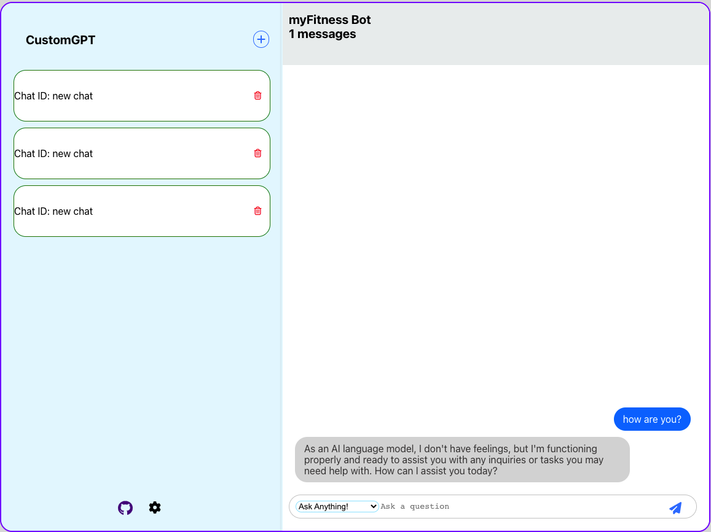

# Custom-GPT App

Still in Development!

The Custom-GPT App is a chatroom-based messaging application built using React and powered by OpenAI's API. It allows users to engage in conversations and receive responses generated by the GPT-3 language model.

## Table of Contents

- [Installation](#installation)
- [Usage](#usage)
- [API Configuration](#api-configuration)
- [File Structure](#file-structure)
- [Customization](#customization)
- [Examples](#examples)
- [Contribution Guidelines](#contribution-guidelines)
- [License](#license)
- [Contact](#contact)

## Installation

To run the app locally, follow these steps:

1. Clone the repository: `git clone https://github.com/dfinkle1/custom-gpt`
2. Navigate to the project directory: `cd custom-gpt`
3. Install dependencies: `npm install`
4. Configure the environment variables or API key required for OpenAI's API.
5. Start the development server: `npm start`
6. Open the app in your browser at `http://localhost:3000`

## Usage

The Custom-GPT App features a chatroom system on the left column and a messaging system on the right column. Users can interact with the app by:

- Custom prompts for users to ask simple or basic questions.
- Selecting a chatroom from the list of available chatrooms.
- Sending messages in the selected chatroom and receiving responses generated by the GPT-3 model.
- Navigating between different chatrooms to engage in multiple conversations simultaneously.

## API Configuration

To use the Custom-GPT App with OpenAI's API, follow these steps:

1. Sign up for an API key from OpenAI.
2. Configure the API key in the app by either setting it as an environment variable or modifying the configuration file.
3. Ensure that you comply with the terms and conditions of OpenAI's API usage and any usage limits or restrictions.

## Customization

The Custom-GPT App provides customization options for users, including:

- Modifying the app's styling by editing the CSS files or applying custom styles.
- Adjusting the chatroom settings, such as the number of displayed messages or the appearance of the chat interface.
- Adding additional features or integrations to enhance the functionality of the app.

Feel free to customize the app according to your requirements and preferences.

## Examples

Here are some screenshots showcasing the Custom-GPT App:

_Caption for Screenshot 1_

_Caption for Screenshot 2_

Make sure to install these dependencies by running `npm install` before starting the app.

## Contribution Guidelines

Contributions to the Custom-GPT App are welcome! If you'd like to contribute, please follow these guidelines:

- Fork the repository and create a new branch for your contribution.
- Ensure that your code adheres to the project's coding style and guidelines.
- Submit a pull request with a detailed description of your changes and any related issues.

## License

The Custom-GPT App is licensed under the [MIT License](LICENSE).

## Contact

For any inquiries or questions, please contact [Daniel Finkle](mailto:daniel.finkle@gmail.com).
